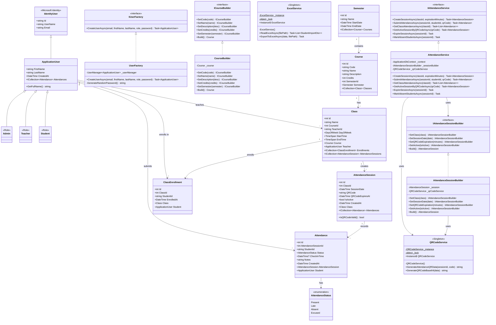
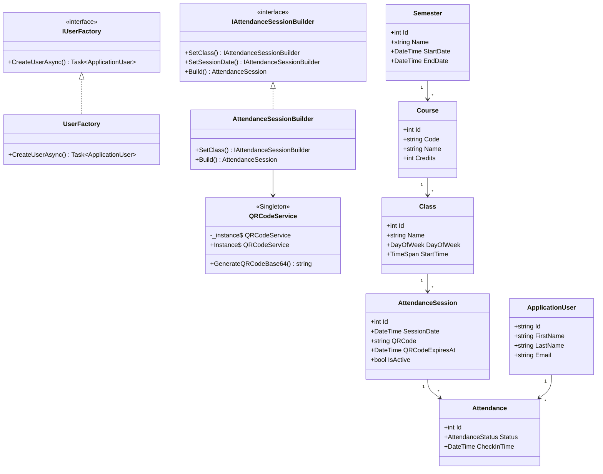
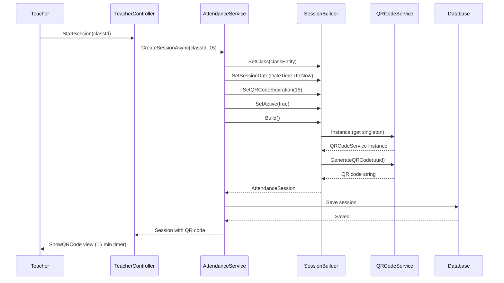
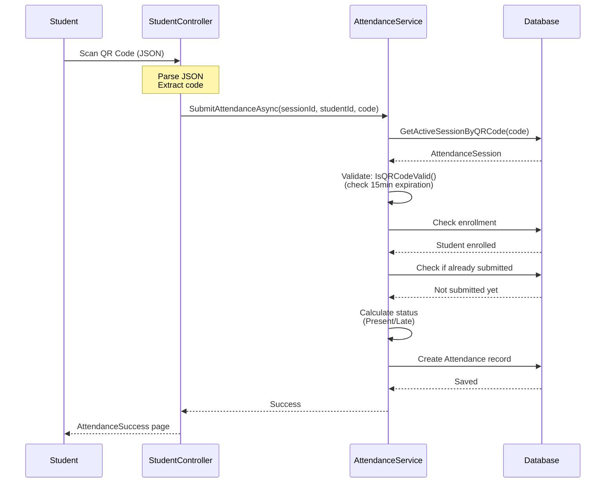
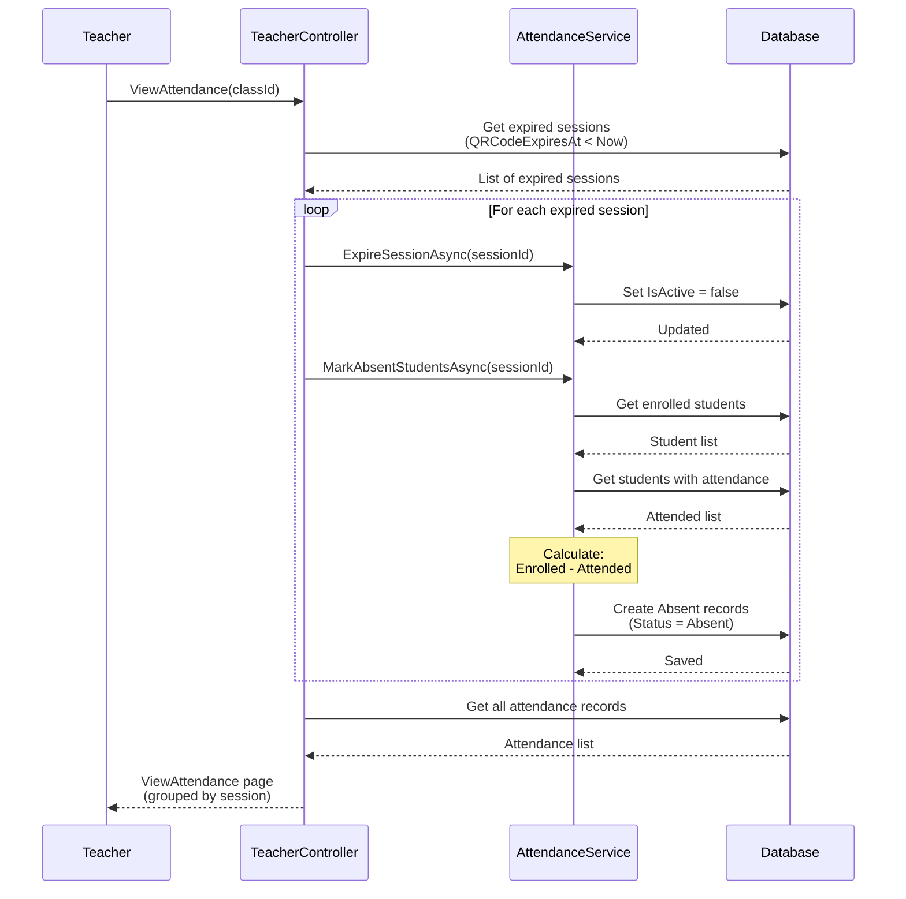

# Mermaid UML Diagrams for Attendance System

## Main Class Diagram

Copy and paste this into https://www.mermaidchart.com/

---

## Simplified Class Diagram (Core Components Only)

If the above is too complex, use this simplified version:

---

## Sequence Diagram 1: Start Attendance Session

---

## Sequence Diagram 2: Submit Attendance (QR Scan)

---

## Sequence Diagram 3: Auto-Expire Session

---

## Usage Instructions

### For Mermaid Chart (https://www.mermaidchart.com/):

1. Copy the code block (starting with `classDiagram` or `sequenceDiagram`)
2. Paste into the Mermaid Chart editor
3. The diagram will render automatically
4. Export as PNG/SVG for your report

### Tips:

- **Main Class Diagram**: Shows all design patterns and relationships (comprehensive)
- **Simplified Class Diagram**: Shows core components only (easier to read)
- **Sequence Diagrams**: Show the flow of operations

### For Your Report:

Include:
1. **Main Class Diagram** - to show complete architecture
2. **Sequence Diagram 1** - to show Builder and Singleton patterns in action
3. **Sequence Diagram 2** - to show student attendance flow
4. **Sequence Diagram 3** - to show auto-expiration feature

You can also export these as images and include them in your DESIGN_REPORT_OPTION4.md!
